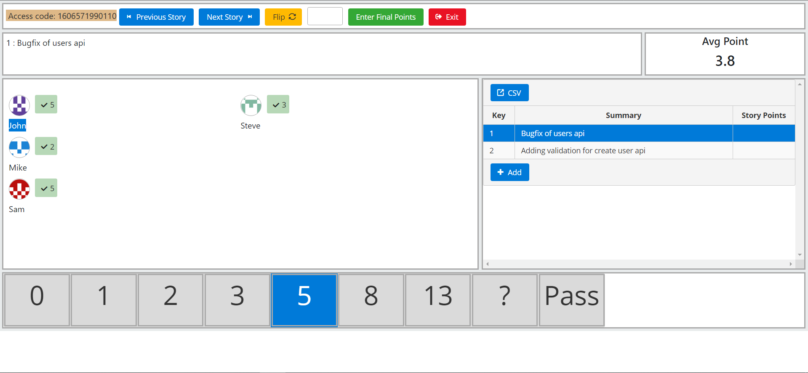

# PointingPoker

Pointing poker is a web app which helps agile teams to use it during their planning/pointing sessions to effectively communicate points for stories.

The frontend application is built with angular/react on a frontend, it's your choice which framework to opt for.
The backend is built with Python.

#### Running on local
##### Running server
`cd server`

`pip install -r requirements.txt`

`python main.py`

##### Running UI with react (For angular, refer [Readme](./client-angular/README.md) in client-angular directory)
`cd client-react`

`npm install`

`npm run start`

Make sure, the file upload format must be .csv and with column names as Key,Summary,Story Points. [Sample file](./assets/sample.csv)

